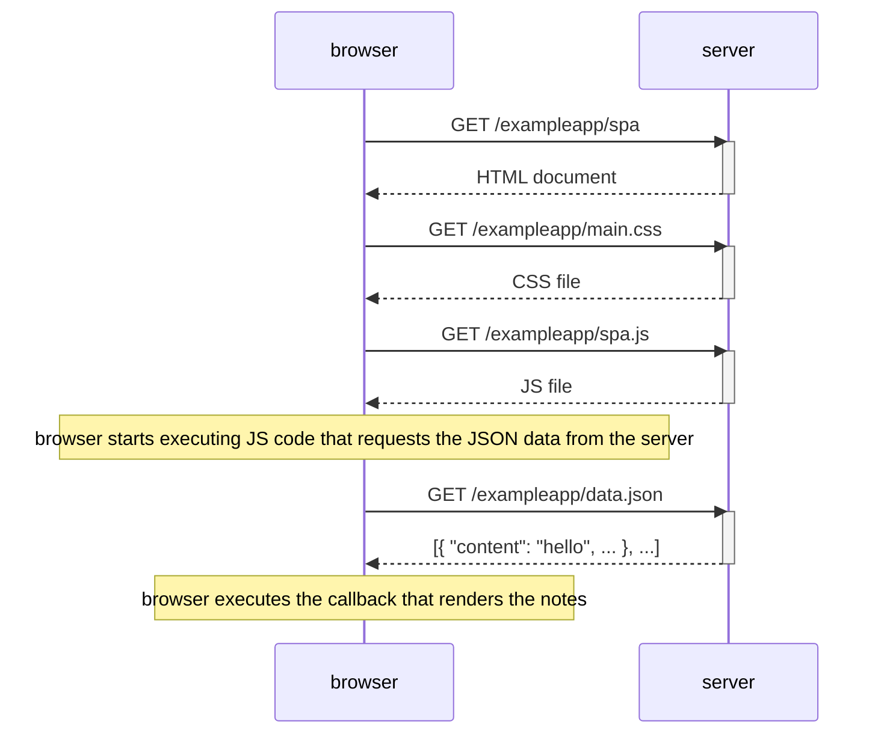

```mermaid
sequenceDiagram
    participant browser
    participant server

    browser->>server: GET /exampleapp/spa
    activate server
    server-->>browser: HTML document
    deactivate server

    browser->>server: GET /exampleapp/main.css
    activate server
    server-->>browser: CSS file
    deactivate server

    browser->>server: GET /exampleapp/spa.js
    activate server
    server-->>browser: JS file
    deactivate server

    Note over browser: browser starts executing JS code that requests the JSON data from the server

    browser->>server: GET /exampleapp/data.json
    activate server
    server-->>browser: [{ "content": "hello", ... }, ...]
    deactivate server

    Note over browser: browser executes the callback that renders the notes
```
