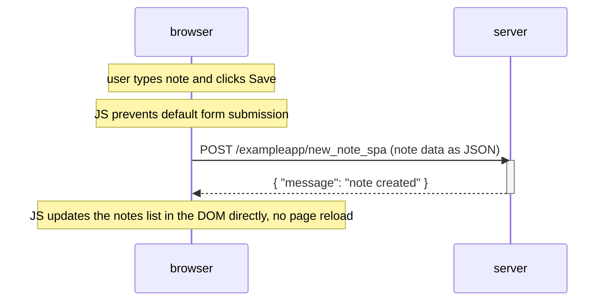

```mermaid
sequenceDiagram
    participant browser
    participant server

    Note over browser: user types note and clicks Save
    Note over browser: JS prevents default form submission

    browser->>server: POST /exampleapp/new_note_spa (note data as JSON)
    activate server
    server-->>browser: { "message": "note created" }
    deactivate server

    Note over browser: JS updates the notes list in the DOM directly, no page reload
```
